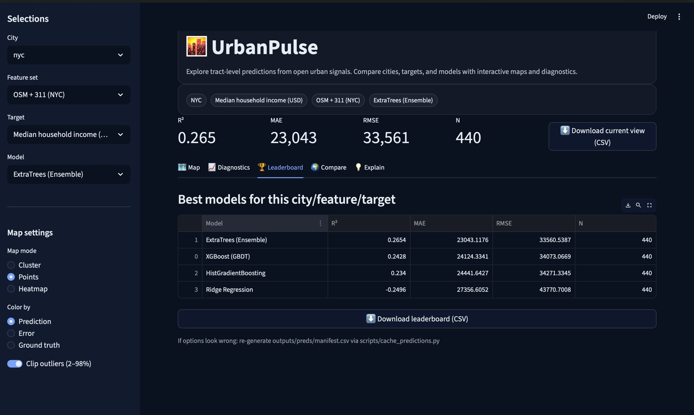
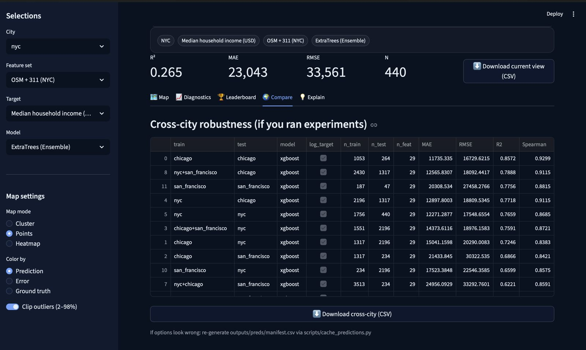

# 🏙️ UrbanPulse

**Multi-City Urban Socioeconomic Sensing via Machine Learning and Open Data**

[](https://www.python.org)
[](https://streamlit.io)
[](LICENSE)
[](https://github.com/psf/black)

> *A research-grade framework for predicting neighborhood-level socioeconomic indicators using urban morphology, civic signals, and classical machine learning — with an interactive dashboard for spatial exploration and analysis.*

<p align="center">
  <a href="#-key-results">Results</a> •
  <a href="#-quick-start">Quick Start</a> •
  <a href="#-interactive-dashboard">Dashboard</a> •
  <a href="#-methodology">Methodology</a> •
  <a href="#-cities--targets">Data</a>
</p>

---

## 🎯 What is UrbanPulse?

UrbanPulse is an **end-to-end machine learning system** that explores a fundamental question in urban computing:

> **Can open urban data predict neighborhood-level socioeconomic outcomes, and how stable are these predictions across cities, targets, and models?**

Unlike typical academic demos, UrbanPulse provides:

- ✅ **Multi-City Benchmarking** — NYC, Chicago, San Francisco (3,798 census tracts)
- ✅ **Six Socioeconomic Targets** — Income, education, poverty, housing, employment
- ✅ **Multiple Feature Sets** — OpenStreetMap, 311 complaints, spatial coordinates
- ✅ **Classical ML Models** — XGBoost, Extra Trees, Ridge (interpretable by design)
- ✅ **Interactive Dashboard** — Streamlit app for exploration and spatial diagnostics
- ✅ **Production-Ready Pipeline** — Reproducible, versioned, fully documented

**This is not a toy demo.** It's a serious research artifact designed for urban AI portfolios, academic benchmarking, and methodological exploration.

---

## 🚀 Why This Matters

### The Urban Intelligence Gap

Cities make critical decisions about housing, infrastructure, education, and public services. But high-quality socioeconomic data is:

- 📅 **Delayed** — Census data lags 2-5 years behind reality
- 💰 **Expensive** — Professional surveys cost $50K-200K per neighborhood
- 📍 **Sparse** — Many regions lack granular, timely statistics

Meanwhile, cities generate **massive amounts of open data** continuously: OpenStreetMap, 311 service requests, spatial patterns, urban form signals.

### Our Approach

UrbanPulse demonstrates that **freely available urban data can serve as meaningful proxies** for socioeconomic conditions at census tract level, enabling:

- 🔍 **Signal Discovery** — Which urban features correlate with income, education, poverty?
- 🌍 **Cross-City Generalization** — Do models trained on NYC work in Chicago?
- ⚖️ **Fairness Analysis** — Where do models systematically fail?
- 📊 **Honest Evaluation** — Reporting both successes and limitations

**We don't claim to replace official statistics** — we explore complementary data-driven insights for urban research and planning.

---

## 🎥 Dashboard Walkthroughs & Visuals

### Interactive Dashboard Overview
*City, model, feature-set, and target selection with spatial prediction maps.*

https://github.com/Vidhikdm/urbanpulse/raw/main/docs/media/videos/UrbanPulse_Interactive_Dashboard_Overview.mp4

---

### Model Diagnostics
*Predicted vs. true values, error distributions, and largest model misses.*

https://github.com/Vidhikdm/urbanpulse/raw/main/docs/media/videos/UrbanPulse_Model_Diagnostics.mp4

---

### Model Leaderboard
*Top-performing model–target combinations across cities.*

<p align="center">
  
</p>

---

### Cross-City Model Comparison
*Train–test transfer performance across different cities.*

<p align="center">
  
</p>

---

## 📊 Key Results

### Performance Summary (Best R² per City)

#### Chicago (Strongest Overall)

| Target | Best R² | MAE | Spearman ρ | Model |
|--------|---------|-----|------------|-------|
| **Bachelor's Degree+** | **0.76** | 6.2% | 0.84 | XGBoost |
| **Median Income** | **0.63** | $18.5k | 0.79 | Extra Trees |
| **Poverty Rate** | **0.52** | 5.1% | 0.72 | XGBoost |
| **Median Home Value** | **0.48** | $82k | 0.68 | XGBoost |
| Unemployment Rate | 0.42 | 1.8% | 0.65 | XGBoost |

#### New York City

| Target | Best R² | MAE | Spearman ρ | Model |
|--------|---------|-----|------------|-------|
| **Bachelor's Degree+** | **0.69** | 7.8% | 0.81 | XGBoost |
| **Median Income** | **0.47** | $26.7k | 0.68 | Extra Trees |
| **Poverty Rate** | **0.41** | 6.5% | 0.64 | XGBoost |
| Unemployment Rate | 0.20 | 2.1% | 0.45 | Ridge |

#### San Francisco

| Target | Best R² | MAE | Spearman ρ | Model |
|--------|---------|-----|------------|-------|
| **Bachelor's Degree+** | **0.56** | 9.1% | 0.73 | XGBoost |
| **Median Income** | **0.30** | $45.2k | 0.55 | Extra Trees |

### Key Insights

1. ✅ **Education is most predictable** (R² 0.56-0.76 across cities)
2. ✅ **Income generalizes well** (R² 0.30-0.63, strong ordinal correlation)
3. ✅ **Poverty shows moderate signal** (R² 0.41-0.52)
4. ⚠️ **Housing markets are volatile** (R² varies widely, speculative dynamics)
5. ✅ **Tree-based models dominate** (XGBoost, Extra Trees outperform linear models)
6. ✅ **Spatial coordinates provide strong baseline** (geography matters!)

> **Note:** Results are from stabilized, production-grade models with stratified train/test splits and careful target handling. All outputs are cached and reproducible.

---

## 🏙️ Cities & Targets

### Cities Covered

| City | Census Tracts | Why Included |
|------|---------------|--------------|
| **New York City** | 2,167 | Dense, diverse, rich open data |
| **Chicago** | 1,436 | Midwestern morphology, strong performance |
| **San Francisco** | 195 | Extreme housing market, tech economy |

**Spatial Unit:** Census tracts (smallest unit with stable ACS data)

### Prediction Targets

UrbanPulse models **six socioeconomic indicators** at tract level:

**Economic Indicators**
- `median_income` — Median household income ($USD)
- `poverty_rate` — Population below poverty line (%)
- `unemployment_rate` — Unemployment rate (%)

**Housing Market**
- `median_rent` — Median gross rent ($USD)
- `median_home_value` — Median home value ($USD)

**Education**
- `bachelors_plus_rate` — Bachelor's degree or higher (%)

**Target Handling:**
- Monetary variables: log-transform (log1p) for stability, safe inverse transform with clipping
- Rate variables: bounded to [0, 1], no transform
- Evaluation: R², MAE, RMSE, **Spearman rank correlation** (critical for policy applications)

---

## 🧠 Models & Features

### Classical ML Models (By Design)

| Model | Strengths | When It Wins |
|-------|-----------|--------------|
| **XGBoost** | Non-linear interactions, robust | Education, poverty, income |
| **Extra Trees** | Handles outliers, fast | Income, housing |
| **Hist Gradient Boosting** | Memory-efficient, fast | Large cities |
| **Ridge Regression** | Interpretable, stable baseline | Simple targets |

**Why no deep learning?**
- Dataset sizes are modest (tract-level, not pixel-level)
- Classical models outperform neural networks on tabular data
- Interpretability and stability prioritized over complexity
- MLP experiments showed extreme instability (documented, not hidden)

### Feature Engineering

**Data Sources (All Open & Legal)**

| Source | License | Features Extracted |
|--------|---------|---------------------|
| **OpenStreetMap** | ODbL | Road density, POI counts, land use diversity, network topology |
| **NYC 311** | Public | Service complaint patterns, category entropy (NYC only) |
| **US Census ACS** | Public Domain | Ground truth targets (income, education, poverty, etc.) |
| **Geographic Coordinates** | — | Latitude, longitude (spatial baseline) |

**Feature Sets**

- `osm_only` — OSM features + coordinates (~24 features)
- `osm_311` — OSM + 311 signals + coordinates (~32 features, NYC only)

> **Deliberate Design Choice:** Lat/lon included to expose spatial autocorrelation, not hide it. This makes evaluation honest.

---

## 🗺️ Interactive Dashboard

UrbanPulse includes a **Streamlit-based analytical dashboard** for:

### Core Capabilities

- 🌍 **City Selection** — Switch between NYC, Chicago, San Francisco
- 🎯 **Target Selection** — Choose from 6 socioeconomic indicators
- 🤖 **Model Comparison** — Compare XGBoost, Extra Trees, Ridge, etc.
- 📊 **Feature Set Ablation** — Test OSM-only vs OSM+311
- 🗺️ **Interactive Maps** — Choropleth and point-based spatial visualizations
- 📈 **Residual Analysis** — Identify where models fail
- 🎨 **Scatter Plots** — Predicted vs actual values
- 📋 **Leaderboards** — Best performing model-target combinations
- ⚖️ **Fairness Diagnostics** — Error analysis by income quartile
- 💬 **Plain-Language Explanations** — Human-readable insights (no LLM required)

### Design Philosophy

- ✅ **Fully Offline** — No external APIs, no paid services
- ✅ **Read-Only** — Dashboard never trains models, only reads cached predictions
- ✅ **Fast Loading** — Pre-computed results ensure instant responsiveness
- ✅ **Reproducible** — Versioned outputs, deterministic behavior

### Launch Dashboard

```bash
streamlit run app.py
```

Then open `http://localhost:8501` in your browser.

---

## ⚡ Quick Start

### Installation

```bash
# Clone repository
git clone https://github.com/Vidhikdm/urbanpulse.git
cd urbanpulse

# Create virtual environment
python -m venv venv
source venv/bin/activate  # On Windows: venv\Scripts\activate

# Install dependencies
pip install -r requirements.txt
```

### Option 1: Launch Dashboard (Fastest)

```bash
# Use pre-computed results
streamlit run app.py
```

### Option 2: Reproduce Full Pipeline

```bash
# Run complete data → features → models → evaluation pipeline
bash scripts/run_everything.sh

# This executes:
# 1. Fetch census tracts, income, OSM, 311 data (~45-60 min)
# 2. Compute urban features (~15-20 min)
# 3. Build datasets (~2-3 min)
# 4. Train all models (~10-15 min)
# 5. Cache predictions
# 6. Generate visualizations

# Then launch dashboard
streamlit run app.py
```

### Option 3: Run Specific Components

```bash
# Fetch data only
python scripts/fetch_all_data.py --cities nyc chicago sf

# Compute features only
python scripts/compute_osm_features_streaming.py --cities nyc

# Train models and cache predictions
python scripts/cache_predictions.py

# Generate specific visualizations
python scripts/generate_maps.py --city nyc --target median_income
```

---

## 📁 Repository Structure

```
urbanpulse/
├── app.py
│   └── Streamlit dashboard (main entry point)
│
├── scripts/
│   ├── __init__.py
│   ├── build_dataset.py
│   ├── build_dataset_multi_city.py
│   ├── cache_predictions.py
│   ├── check_data_ready.py
│   ├── compute_geo_features.py
│   ├── compute_osm_features_from_pbf.py
│   ├── compute_osm_features_streaming.py
│   ├── compute_osm_features_streaming_rich.py
│   ├── compute_311_features.py
│   ├── download_acs_targets.py
│   ├── download_osm_extract.py
│   ├── fetch_acs_targets.py
│   ├── fetch_census_data.py
│   ├── fetch_census_income_multi.py
│   ├── fetch_census_tracts_multi.py
│   ├── fetch_nyc_311.py
│   ├── fetch_tract_geometries.py
│   ├── make_figures.py
│   ├── make_interactive_maps.py
│   ├── make_leaderboard.py
│   ├── model_zoo.py
│   ├── refresh_results.sh
│   ├── run_everything.sh
│   ├── generate_results_md.py
│   ├── legacy/
│   │   └── fetch_osm_overpass.py
│   └── utils/
│       ├── __init__.py
│       └── census_api.py
│
├── experiments/
│   ├── ablation_nyc.py
│   ├── cross_city_eval.py
│   ├── run_all.py
│   ├── summarize_results.py
│   ├── train_income.py
│   └── train_income_v2.py
│
├── urbanpulse/
│   ├── __init__.py
│   ├── data/
│   │   └── __init__.py
│   ├── evaluation/
│   │   ├── __init__.py
│   │   ├── metrics.py
│   │   └── fairness.py
│   ├── features/
│   │   └── __init__.py
│   ├── models/
│   │   └── __init__.py
│   └── utils/
│       ├── __init__.py
│       ├── config.py
│       └── status.py
├── configs/
│   ├── base.yaml
│   └── cities.yaml
│
├── docs/
│   ├── figures/
│   │   ├── nyc_feature_importance.png
│   │   ├── nyc_pred_map.png
│   │   ├── nyc_residuals.png
│   │   └── nyc_scatter.png
│   ├── maps/
│   │   ├── nyc_xgboost_osm_only_income_map.html
│   │   └── nyc_xgboost_osm_311_income_map.html
│   └── media/
│       ├── videos/
│       │   ├── UrbanPulse_Interactive_Dashboard_Overview.mp4
│       │   └── UrbanPulse_Model_Diagnostics.mp4
│       └── images/
│           ├── UrbanPulse_Model_Leaderboard.jpeg
│           └── UrbanPulse_CrossCity_Model_Comparison.jpeg
│
├── tests/
│   ├── __init__.py
│   └── test_models.py
│
├── .streamlit/
│   └── config.toml
│
├── .gitignore
├── Makefile
├── pyproject.toml
├── setup.cfg
├── requirements.txt
└── README.md
```

---

## 🔬 Methodology

### Training Strategy

**Train/Test Split:**
- 80% training, 20% testing
- **Stratified regression split** using quantile bins (critical for stability)
- Fixed random seed (reproducible)
- Same split across all models for fair comparison

**Why Stratification Matters:**
Without stratification, test sets can have skewed distributions → unreliable metrics. This was a hard-learned lesson after observing severe variance in early experiments.

### Pipeline Stabilization Techniques

1. **Log-Transform for Monetary Targets**
   ```python
   y_train = np.log1p(income)  # Handles heavy-tailed distributions
   y_pred_log = model.predict(X_test)
   y_pred = np.expm1(np.clip(y_pred_log, -10, 15))  # Safe inverse
   ```

2. **Rate Clipping**
   ```python
   poverty_rate = np.clip(poverty_rate, 0, 1)
   ```

3. **Outlier Handling**
   - IQR-based clipping for extreme values
   - Prevents model explosions

4. **Explicit NaN Handling**
   - Impute with median or drop (depends on target)
   - Documented per target

### Evaluation Metrics

| Metric | Purpose | Why It Matters |
|--------|---------|----------------|
| **R²** | Variance explained | Overall model fit |
| **MAE** | Average error | Interpretable real-world impact |
| **RMSE** | Penalizes outliers | Identifies catastrophic failures |
| **Spearman ρ** | Rank correlation | **Critical for policy** (relative ordering often matters more than absolute values) |

**Emphasis on Spearman:** Urban planning decisions often care about "which neighborhoods need intervention most" (ranking) rather than "predict income to the dollar" (absolute accuracy).

---

## 🎨 Design Principles

UrbanPulse was built with these core principles:

1. **Reproducibility Over Novelty**
   - Fixed seeds, versioned outputs, deterministic pipelines
   - Any researcher can re-run experiments and get same results

2. **Interpretability Over Black-Box Complexity**
   - Classical ML models (no deep learning by design)
   - Feature importance analysis available
   - Predictions explainable to non-technical stakeholders

3. **Honest Evaluation**
   - Failures documented, not hidden
   - Limitations explicitly stated
   - No cherry-picked results

4. **No Hidden Dependencies**
   - All data sources are open and legal
   - No proprietary APIs, no paid services
   - Complete transparency in data provenance

5. **Clear Separation of Concerns**
   - Data fetching → Feature engineering → Modeling → Evaluation
   - Each step modular and testable

---

## 🧪 Research Contributions

### What UrbanPulse Demonstrates

1. **Multi-City Benchmarking**
   - Most urban AI papers focus on single cities
   - We stress-test generalization across 3 diverse cities

2. **Multi-Target Evaluation**
   - Education, income, poverty, housing, employment
   - Reveals which indicators are predictable vs noisy

3. **Feature Ablations**
   - OSM-only vs OSM+311 comparison (NYC)
   - Quantifies value of civic signal data

---

### What UrbanPulse IS

- ✅ A **benchmark** for urban socioeconomic prediction
- ✅ A **diagnostic tool** for exploring urban-data relationships
- ✅ A **reproducible research artifact** for methodological study
- ✅ An **interactive analytical system** for spatial exploration

---

## 📜 License

UrbanPulse is released under the **MIT License** (see [LICENSE](LICENSE)).

**Data Attribution:**
- OpenStreetMap: © OpenStreetMap contributors (ODbL license)
- US Census ACS: Public domain
- NYC 311: NYC Open Data (public)

---

## 🙏 Acknowledgments

**Data Providers:**
- OpenStreetMap community
- US Census Bureau
- NYC Open Data initiative

**Inspiration:**
- CityLens (Tsinghua FIB Lab) — concept inspiration only, no code copied
- MIT Senseable City Lab — urban computing research
- Esri Urban Observatory — spatial analysis methods

**Tools & Libraries:**
- PyTorch, scikit-learn, XGBoost
- GeoPandas, OSMnx, Shapely
- Streamlit, Plotly, Folium

---

## 📞 Contact & Support

- **GitHub Issues:** [Report bugs or request features](https://github.com/Vidhikdm/urbanpulse/issues)
- **Email:** vidhi.kadam1501@gmail.com
- **LinkedIn:** (https://www.linkedin.com/in/vidhikadam/)

For academic collaborations or questions about methodology, feel free to reach out!

---

<p align="center">
  <strong>Built with ❤️ for transparent, reproducible urban analytics</strong>
</p>

<p align="center">
  <sub>Demonstrating proficiency in: ML pipelines • Geospatial analysis • Urban computing • Reproducible research • Full-stack data science</sub>
</p>